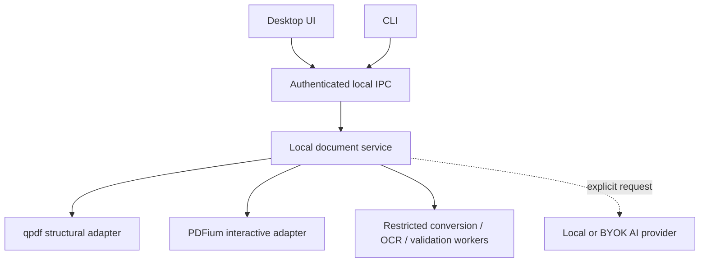

# Architecture

## Local-first process model

The desktop shell is a client. Parsing, rendering, conversion, and mutation must not run on its UI thread.

## Component rules

1. Application-facing code depends on engine-neutral contracts in `document-core`.
2. Only `qpdf-adapter` may depend on libqpdf headers or ABI.
3. Only `pdfium-adapter` may depend on PDFium headers or ABI.
4. Native calls remain inside restricted processes where feasible and return typed errors rather than terminating the UI.
5. Conversion, OCR, and validation run as cancellable jobs with CPU, memory, time, filesystem, and network limits.
6. Document bytes remain local unless a user invokes an explicitly remote operation.
7. The desktop and CLI use the same versioned operation contracts.

## Engine roles

qpdf is the source of truth for content-preserving structural transformations such as page assembly, encryption, linearization, and normalization. It is pinned from `pdf-workbench-qpdf` so local patches remain visible and can be proposed upstream.

PDFium is the rendering and interactive-document engine. It will be built without V8 and XFA to exclude PDF JavaScript execution and dynamic XFA behaviour.

Cross-engine operations must close/reopen the document through a controlled session boundary. Tests must verify that qpdf mutations remain renderable and semantically consistent in PDFium.

## Cloud boundary

Hosted signing, delivery, accounts, audit trails, webhooks, remote jobs, and managed AI are separate products. They do not belong in this Apache-2.0 repository. A future service may depend on released core artefacts through a versioned interface and may use AGPL-3.0 or remain private, subject to its own decision record.
